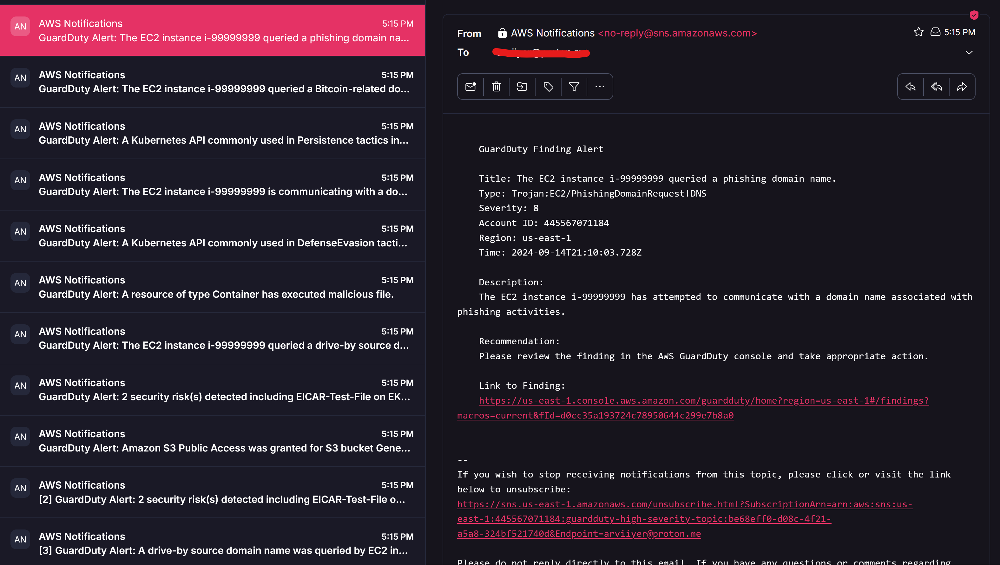
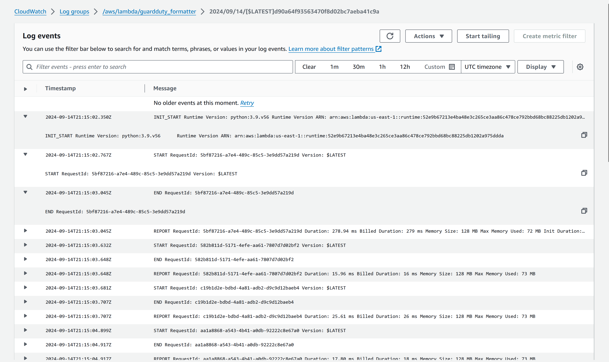

# AWS GuardDuty Threat Detection Solution

This repository showcases an AWS-based threat detection solution using **AWS GuardDuty**, **Amazon EventBridge**, **AWS Lambda**, and **Amazon SNS**. The solution is deployed using **Terraform** and is designed to monitor and detect malicious activity within a single AWS account. High-severity findings trigger email notifications to the security team.

---

## Table of Contents

- [Overview](#overview)
- [Architecture](#architecture)
- [Prerequisites](#prerequisites)
- [Deployment Steps](#deployment-steps)
- [Testing the Setup](#testing-the-setup)
- [Cleanup](#cleanup)
- [Cost Considerations](#cost-considerations)
- [Conclusion](#conclusion)
- [References](#references)
- [License](#license)
- [Contact](#contact)

---

## Overview

This project implements a threat detection solution that:

- Enables **AWS GuardDuty** to monitor for malicious activity.
- Configures **Amazon EventBridge** to capture high-severity GuardDuty findings.
- Uses an **AWS Lambda Function** to format findings into human-readable messages.
- Sends email notifications via **Amazon SNS** to the security team.
- Deploys the entire infrastructure using **Terraform** for consistency and automation.

---

## Architecture

The solution architecture is as follows:


> **Note:** The architecture diagram illustrates the flow of data and interactions between AWS services.

### Components

1. **AWS GuardDuty**
   - Monitors the AWS account for threats and generates security findings.

2. **Amazon EventBridge**
   - Captures high-severity findings from GuardDuty based on defined event patterns.
   - Triggers the Lambda function when a matching event occurs.

3. **AWS Lambda Function**
   - Processes the GuardDuty finding and formats it into a readable email message.
   - Publishes the formatted message to the SNS topic.

4. **Amazon SNS Topic**
   - Distributes the message received from Lambda to subscribed endpoints (email).

5. **Email Subscriber (Security Team)**
   - Receives email notifications containing the formatted GuardDuty findings.

6. **IAM Roles and Policies**
   - Provide necessary permissions for services to interact securely.

---

## Prerequisites

- **AWS Account** with appropriate permissions to create resources.
- **AWS CLI** installed and configured.
- **Terraform** installed (version 0.12 or higher).
- **An Email Address** to receive notifications (e.g., `arviiyer@proton.me`).

---

## Deployment Steps

Follow these steps to deploy the solution:

### 1. Clone the Repository

```bash
git clone https://github.com/yourusername/aws-guardduty-threat-detection.git
cd aws-guardduty-threat-detection
```

### 2. Prepare the Lambda Function

- Create a file named `lambda_function.py` with the following content:

  ```python
  import json
  import os
  import boto3

  sns_client = boto3.client('sns')
  sns_topic_arn = os.environ['SNS_TOPIC_ARN']

  def lambda_handler(event, context):
      # Parse the GuardDuty finding
      detail = event.get('detail', {})
      finding_type = detail.get('type', 'Unknown')
      severity = detail.get('severity', 'Unknown')
      description = detail.get('description', 'No description provided')
      region = detail.get('region', 'Unknown')
      account = detail.get('accountId', 'Unknown')
      time = detail.get('updatedAt', 'Unknown')
      title = detail.get('title', 'GuardDuty Finding')

      # Format the message
      message = f"""
      GuardDuty Finding Alert

      Title: {title}
      Type: {finding_type}
      Severity: {severity}
      Account ID: {account}
      Region: {region}
      Time: {time}

      Description:
      {description}

      Recommendation:
      Please review the finding in the AWS GuardDuty console and take appropriate action.

      Link to Finding:
      https://{region}.console.aws.amazon.com/guardduty/home?region={region}#/findings?macros=current&fId={detail.get('id', '')}
      """

      # Publish the message to SNS
      response = sns_client.publish(
          TopicArn=sns_topic_arn,
          Subject=f"GuardDuty Alert: {title}",
          Message=message
      )

      return {
          'statusCode': 200,
          'body': json.dumps('Notification sent')
      }
  ```

- Zip the Lambda function code:

  ```bash
  zip lambda_function.zip lambda_function.py
  ```

### 3. Configure Terraform Variables

- Update the `variables.tf` file if you need to change default values:

  ```hcl
  variable "aws_region" {
    description = "AWS region to deploy resources in"
    type        = string
    default     = "us-east-1"
  }

  variable "email_address" {
    description = "Email address to receive SNS notifications"
    type        = string
    default     = "arviiyer@proton.me"
  }
  ```

### 4. Initialize Terraform

```bash
terraform init
```

#### Screenshot: Terraform Initialization


> **Note:** The screenshot shows successful initialization of Terraform.

### 5. Review the Execution Plan

```bash
terraform plan
```

#### Screenshot: Terraform Plan Output


> **Note:** Review the plan to ensure all resources will be created as expected.

### 6. Apply the Configuration

```bash
terraform apply
```

- Type `yes` when prompted to confirm.

#### Screenshot: Terraform Apply Output


> **Note:** The screenshot shows successful creation of resources.

### 7. Confirm SNS Subscription

- Check your email inbox for a confirmation message from AWS SNS.
- Click the **"Confirm subscription"** link in the email.

#### Screenshot: SNS Subscription Confirmation Email


> **Note:** This is the email you receive to confirm your subscription.

---

## Testing the Setup

### 1. Generate Sample GuardDuty Findings

- **Using AWS CLI:**

  ```bash
  aws guardduty create-sample-findings \
    --detector-id $(terraform output -raw guardduty_detector_id) \
    --finding-types "Recon:EC2/PortProbeUnprotectedPort"
  ```

- **Using AWS Console:**

  - Navigate to **GuardDuty** > **Settings**.
  - Click on **"Generate sample findings"**.

#### Screenshot: Generating Sample Findings in AWS Console


> **Note:** The screenshot shows the option to generate sample findings.

### 2. Verify Email Notifications

- Check your email for a notification from the SNS topic.
- The email should contain a formatted message with details about the GuardDuty finding.

#### Sample Email Notification



> **Note:** This is an example of the email received with the formatted GuardDuty finding.

**Sample Email Content:**

```
GuardDuty Finding Alert

Title: Recon:EC2/PortProbeUnprotectedPort
Type: Recon:EC2/PortProbeUnprotectedPort
Severity: 8.9
Account ID: 445567071184
Region: us-east-1
Time: 2024-09-14T18:38:33.556Z

Description:
EC2 instance i-0123456789abcdef is being probed on unprotected ports.

Recommendation:
Please review the finding in the AWS GuardDuty console and take appropriate action.

Link to Finding:
https://us-east-1.console.aws.amazon.com/guardduty/home?region=us-east-1#/findings?macros=current&fId=ca87d279408140ee9373005b15ad9e35
```

### 3. Check Lambda Function Logs (Optional)

- In the AWS Console, navigate to **CloudWatch** > **Logs**.
- Look for the log group `/aws/lambda/guardduty_formatter`.
- Verify that the Lambda function executed without errors.

#### Screenshot: Lambda Function Logs



> **Note:** The logs show successful execution of the Lambda function.

---

## Cleanup

To avoid incurring charges, destroy the resources when they are no longer needed:

```bash
terraform destroy
```

Type `yes` to confirm.

#### Screenshot: Terraform Destroy Output


> **Note:** The screenshot shows resources being destroyed.

---

## Cost Considerations

- **AWS GuardDuty:**
  - **Free Trial:** 30-day free trial.
  - **Charges:** Based on the volume of data processed after the trial.

- **AWS Lambda:**
  - **Free Tier:** 1 million free requests per month.
  - **Charges:** Minimal for low invocation rates.

- **Amazon SNS:**
  - **Email Notifications:** Low cost; charges may apply after certain thresholds.

- **EventBridge:**
  - **Events:** Costs are based on the number of events processed.

---

## Conclusion

This project demonstrates how to set up a cost-effective threat detection solution using AWS services. By leveraging GuardDuty for threat detection, Lambda for processing, and SNS for notifications, organizations can proactively monitor their AWS environments and respond to high-severity security findings promptly.

---

## References

- [AWS GuardDuty Documentation](https://docs.aws.amazon.com/guardduty/latest/ug/what-is-guardduty.html)
- [AWS Lambda Developer Guide](https://docs.aws.amazon.com/lambda/latest/dg/welcome.html)
- [Amazon SNS Documentation](https://docs.aws.amazon.com/sns/latest/dg/welcome.html)
- [Amazon EventBridge Documentation](https://docs.aws.amazon.com/eventbridge/latest/userguide/eb-what-is.html)
- [Terraform AWS Provider](https://registry.terraform.io/providers/hashicorp/aws/latest/docs)
- [AWS Architecture Icons](https://aws.amazon.com/architecture/icons/)

---

## License

This project is licensed under the MIT License. See the [LICENSE](LICENSE) file for details.

---

## Contact

For any questions or suggestions, please contact [rbarvind04@gmail.com](mailto:rbarvind04@gmail.com).

---

**Disclaimer:** Ensure you have the necessary permissions and have reviewed AWS's policies before deploying this solution. Monitor your AWS usage to avoid unexpected charges.

---

**Thank you for exploring this AWS GuardDuty threat detection solution!**